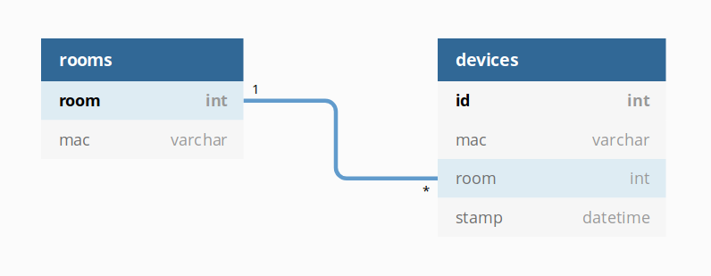

## Documentação

Este repositório é organizado da seguinte forma:

```
IoT-2019/
├── Client/									-- Diretório com arquivos para a página HTML de front end
│   ├── 1Ptug8zYS_SKggPNyC0ITw.woff2
│   ├── 1Ptug8zYS_SKggPNyCMIT5lu.woff2
│   ├── b5.png
│   ├── front.html
│   ├── front.js
│   ├── jquery-3.4.1.min.js
│   ├── mapa_b5.jpg
│   └── raleway.css
├── documentation.txt						-- este arquivo
├── ESP32Files/								-- Arquivos para a ESP32
│   ├── BLE_iBeacon 						
│   │   └── BLE_iBeacon.ino 				-- Arquivo para ser instalado no Beacon
│   └── BTsniferWithPOST/	
│       └── BTsniferWithPOST.ino 			-- Arquivo para ser instalado no Sniffer (sensor)
├── RaspberryFiles/							-- Diretório com arquivos para a Raspberry
│   ├── index.js 							-- script principal
│   ├── node_modules/						-- módulos do Node
│   ├── npm-debug.log
│   ├── package.json
│   └── package-lock.json
└── README.md
```

1. Ideia Resumida

A ideia resumida da aplicação é implementar um sistema de sensores em cada sala, que captam intermitantemente a proximidade de um beacon por meio do atributo força de sinal (RSSI) presente no pacote bluetooth, e com isso indicar qual sala é mais próvável de o beacon estar.

2. Implementação
	
	2.1 Beacon

	A implementação de envio de pacotes bluetooth está documentada passo a passo no arquivo BLE_iBeacon.ino, em ESP32Files/BLE_iBeacon. Ela consiste da criação de um BLE Server e de *BLE advertising*, seguida de um *deep sleep* para redução de consumo de energia.

	2.2 Sniffer

	Nos chips responsáveis por fazerem o papel de *sniffers* deve estar instalado o arquivo BTsniferWithPOST.ino, em ESP32Files/BTsniferWithPOST. Esse sniffer primeiramente se conecta à rede do servidor Raspberry PI, o que é feito na função `wifiInit()`. Depois disso, na função `loop()` o script, com auxílio da biblioteca BLEScan, realiza a leitura do valor RSSI dos pacotes que chegam, assim como o endereço MAC associado, e realiza uma requisição POST, para o servidor, desses valores. O formato dos parâmetros é especificado nos comentários da função `sendPOST()`.

	2.3 Servidor

	O servidor foi implementado em Node.js. O script principal do servidor é o `index.js`, presente no diretório `RaspberryFiles`. Para a criação do servidor e comunicação com o banco de dados postgres, são utilizados os módulos `express` e `pg` (postgres). Este script é responsável por:

	-  Ler do banco de dados, da tabela `rooms`, a relação: MAC do sensor e sua sala associada, guardando isso em memória.
	-  Receber as leituras de RSSI dos sensores - função `work()`
	-  Calcular a sala esperada dos beacons consultados - função `calculateRooms()`, chamada a cada 5 segundos
	-  Registrar as leituras de RSSI no banco de dados - função `calculateRooms()`
	-  Responder a requisições GET da sala, retornando dicionário JSON com todos as salas identificadas com MACs dos beacons como chave - função `work()`.

	A comunicação entre sensores ESP32 e servidor acontece por meio da requisição POST, para a url <IPServidor>/send-data, passando como parâmetros:
	- sourceMac (mac address do sensor)
	- sniffedMac (mac address do beacon)
	- rssi (valor do rssi lido)

	A comunicação entre página frontend e servidor acontece por meio da requisição GET, para a url <IPServidor>/get-data, e o servidor retorna um dicionário JSON em que as chaves são endereços MAC dos beacons e os valores são os IDs de suas salas associadas. Exemplo:
	```
	{
		"23:BF:AA:43:64": 2,
		"C3:B2:11:43:62": 1
	}
	```

	2.4 Página frontend

	A página frontend foi implementada em HTML5, e é o arquivo `front.html`, presente no diretório `Client`. Ela contém o mapa da bloco 5 do ICMC-USP, instituto no qual foi desenvolvido este projeto, mas pode ser alterada para representar outras localizações. O arquivo `front.js`, no mesmo diretório, realiza a renderização e comunicação com o servidor. A cada 5 segundos o script faz um GET request para o servidor, na função `requestData()`, e renderiza um círculo verde na sala onde o beacon respondido está.

	Está página foi desenvolvida como demonstração do funcionamento do projeto, portanto ela só espera o MAC de 1 beacon como resposta da requisição GET. Se mais de um for respondido, ela não distinguirá eles na renderização dos círculos. Por isso ela deve ser adaptada conforme as necessidades do interessado.

3. Banco de Dados
	
	O banco de dados do sistema consiste de duas tabelas: `rooms` e `devices`. A primeira associa o mac do sensor com o ID da sala, enquanto a segunda registra a localização dos beacons nos vários timestamps calculados. O esquemático do banco é mostrado na figura abaixo.

	

	O atributo `stamp` da tabela `devices` tem um valor default `now()`, e o `id` da tabela `devices` tem um valor default de `autoincrement`.